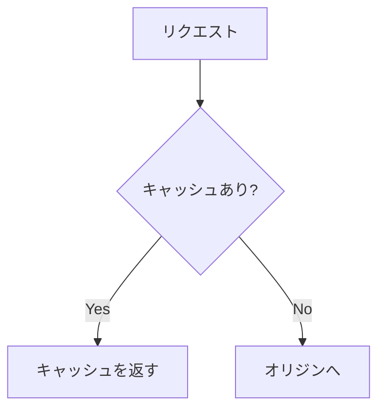

# Zenn 独自記法リファレンス

標準 Markdown（見出し、リスト、表、リンク、引用、水平線）はそのまま使えます。以下は Zenn 固有、または挙動が異なるものだけです。

## メッセージボックス

読者への注意喚起。多用すると効果が薄れるので、記事あたり数個までに抑えます。

```
:::message
補足や豆知識。グレー系で表示されます。
:::

:::message alert
ハマりどころ、破壊的変更、セキュリティ上の注意。赤系で表示されます。
:::
```

## 折りたたみ（アコーディオン）

本筋から外れる長いログ、エラー全文、環境構築手順などを隠します。

```
:::details エラーログ全文
ここが折りたたまれる
:::
```

**入れ子にするときは外側のコロンを増やします。** これを忘れると閉じ位置がずれて記事が崩れます。

```
::::details 環境構築の詳細
:::message
Node.js 20 以上が必要です
:::
::::
```

## コードブロック

ファイル名を付けると、どのファイルの話かが一目で分かります。技術記事では基本的に付けてください。

````
```ts:src/app/page.tsx
export default function Page() {
  return <div>Hello</div>
}
```
````

差分表示。言語名の**前**に `diff` を置きます（`ts diff` ではなく `diff ts`）。

````
```diff ts:src/app/page.tsx
- export default function Page() {
+ export default async function Page() {
```
````

## 数式（KaTeX）

ブロック:

```
$$
e^{i\theta} = \cos\theta + i\sin\theta
$$
```

インライン: `$a \ne 0$`

## Mermaid

````

````

## 埋め込み

URL を単独行に置くだけでカードになるものもありますが、明示するほうが確実です。

| 記法 | 用途 |
|---|---|
| `@[card](URL)` | 一般的なリンクカード |
| `@[tweet](URL)` | X / Twitter の投稿 |
| `@[youtube](URL)` | YouTube 動画 |
| `@[github](URL)` | GitHub のファイル（行指定 `#L10-L20` 可） |
| `@[gist](URL)` | GitHub Gist |
| `@[codepen](URL)` | CodePen |
| `@[codesandbox](URL)` | CodeSandbox（Embed 用 URL を使う） |
| `@[speakerdeck](ID)` | SpeakerDeck（URL ではなく ID） |
| `@[figma](URL)` | Figma |

参考文献や公式ドキュメントへのリンクは `@[card]` にすると視認性が上がります。ただし本文中の細かい参照は普通のインラインリンクのままにしてください。

## 画像

```

```

- **幅指定**: `` — 高さは自動
- **キャプション**: 画像の直後の行に `*キャプション*` を置く
- **リンク付き画像**: `[](https://example.com)`

代替テキストは省略せずに書いてください。スクリーンリーダーだけでなく、記事を Claude に読ませる読者にとっても内容が伝わります。

リポジトリ管理の画像は `images/<記事の slug>/` にまとめると整理しやすく、参照パスは先頭スラッシュ付きの `/images/...` です（`./images/...` ではありません）。

## 脚注

```
Server Components は RSC とも呼ばれます[^1]

[^1]: React Server Components の略。
```

インライン形式もあります: `本文^[脚注の内容]`

## コメント

`<!-- 執筆メモ -->` は出力されません。**複数行コメントは非対応**なので、行ごとに書いてください。

## 注意点

- `:::` 系ブロックの閉じ忘れは、それ以降の記事全体が崩れる原因の第 1 位です
- コードブロック内に ``` を含めたい場合は、外側を 4 つ以上のバッククォートにします
- Zenn の Markdown パーサーは HTML を基本的にエスケープします。`<br>` などに頼らない構成にしてください
